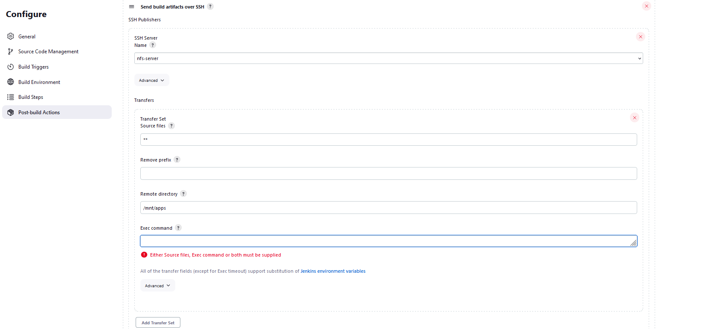

# **Documentation for Project 9**

### Installing JDK

`sudo apt update`
`sudo apt install default-jdk-headless`


### Jenkins Installation

`sudo apt update`
```
curl -fsSL https://pkg.jenkins.io/debian-stable/jenkins.io-2023.key | sudo tee \
  /usr/share/keyrings/jenkins-keyring.asc > /dev/null
echo deb [signed-by=/usr/share/keyrings/jenkins-keyring.asc] \
  https://pkg.jenkins.io/debian-stable binary/ | sudo tee \
  /etc/apt/sources.list.d/jenkins.list > /dev/null
sudo apt-get update
sudo apt-get install jenkins
```


### Jenkins Up and running

`sudo systemctl status jenkins`


## Jenkins Initial Setup

### Accessing jenkings from Browser

`http://<Jenkins-Server-Public-IP-Address-or-Public-DNS-Name>:8080`


### Jenkins Setup Complete


## Connecting Jenkins to Github to retrieve source Codes using Webhooks


### First Successful Jenkins Build


### Post Build Action Configuration


### Location of artifacts on Jenkins Server

`ls /var/lib/jenkins/jobs/Project9/builds/2/archive/`


## Configuring jenkins to copy files to NFS Server Via SSH

### Publish over SSH plugin Installation


### Configuring projects to copy artifacts over to NFS

### Jenkins configured to send all files produced by build to mnt/apps




### Console output after changes has been made to read-me


### Making sure files are updated on NFS Server Successfully


